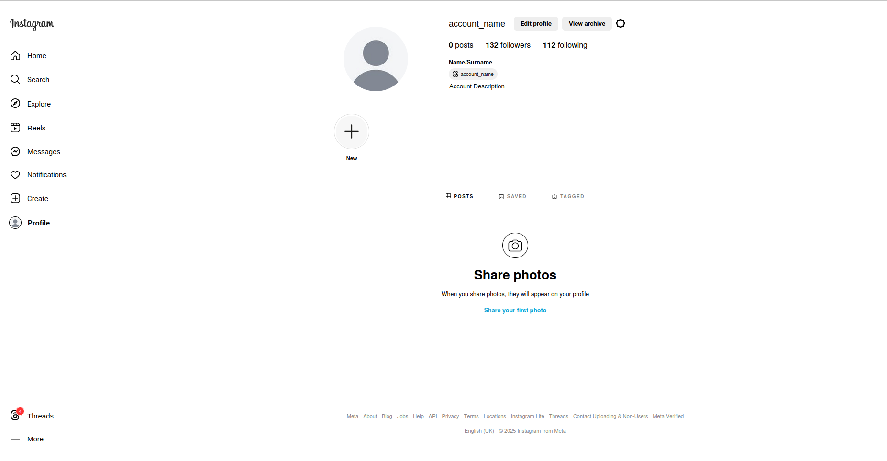

# Instagram User Profile Clone (Posts Section)

This project is a **responsive clone** of the Instagram user profile page under the "Posts" section. It is built purely with **HTML** and **CSS**, with no frameworks or libraries. The project is designed as a learning exercise to practice the basics of front-end development.

## Features

- **Static Design**: Mimics the layout and style of Instagram's user profile posts section.
- **Responsive Layout**: Adapts to different screen sizes (desktop and tablet), though mobile devices are not fully accounted for.
- **Hover Effects**: Includes simple hover effects for interactivity (e.g., underlines for links in the footer).
- **Flexbox Practice**: Uses CSS Flexbox for layout and alignment.
- **Typography and Styling**: Designed with attention to fonts, colors, and spacing to resemble Instagram's aesthetic.

## Preview

  

## How to Use

1. Clone or download this repository:
   ```bash
   git clone https://github.com/your-username/instagram-profile-clone.git
2. Open the index.html file in any browser to view the project.


## Pixel Units and Display Compatibility

This project currently uses `px` for layout and styling, which works well on devices with a device pixel ratio (DPR) of 1. However, it may appear slightly different on high-DPI devices or when the browser zoom setting is changed.

For now, users can adjust their browser zoom settings or view the project on devices with DPR = 1 for the best experience.


## Future Improvements

- Add mobile-friendly support with media queries.
- Replace the use of `px` with scalable units like `rem`, `%`, and `vh/vw` to improve responsiveness and compatibility with high-DPI screens.
- Implement functionality with JavaScript (e.g., dropdown menus, interactivity).
- Optimize for accessibility (ARIA roles, keyboard navigation).
- Include additional sections like the "Highlights" or "Followers" area.


## Personal Notes

This project was a great opportunity to practice the basics of front-end development. It reflects my current level of experience and has helped me better understand responsive design and layout techniques. I'm excited to build on this foundation and improve in future projects.
